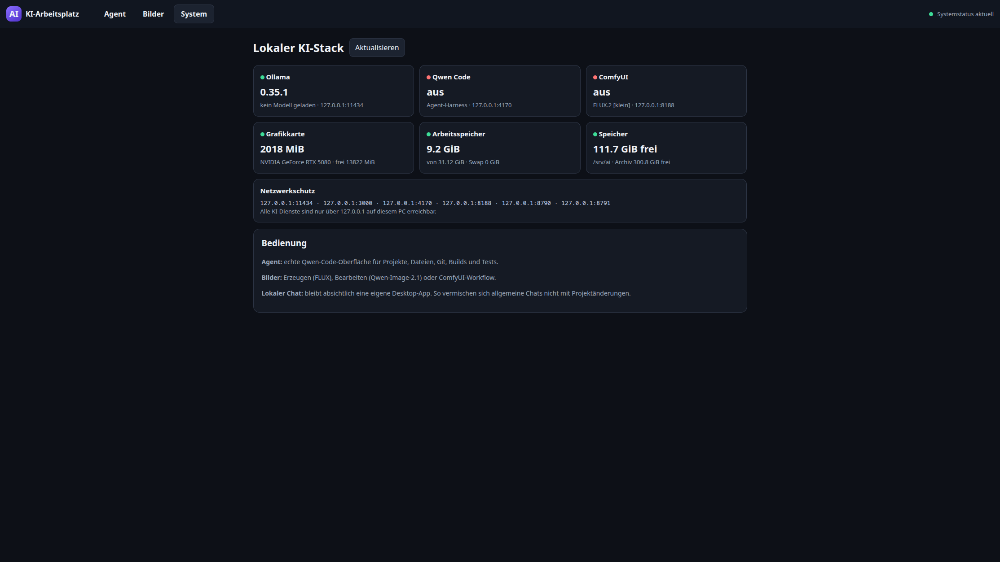
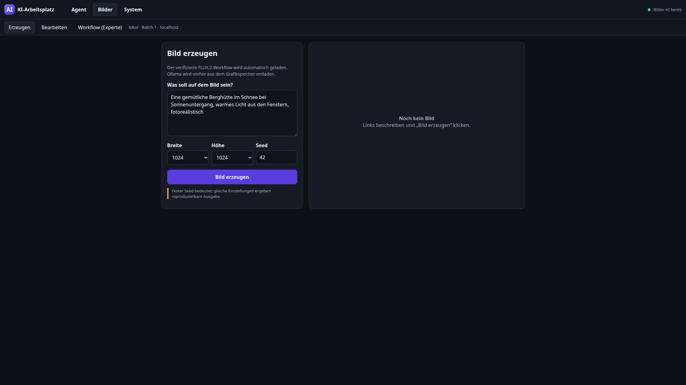
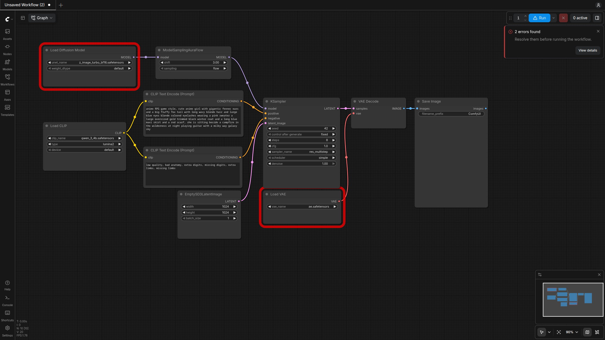

# Linux Lokales KI

Lokaler KI-Stack für Coding-Agent, Chat und Bildgenerierung — **ohne Cloud-Pflicht**, nur auf `127.0.0.1`.

Referenzmaschine: Nobara Linux (Fedora), Desktop-PC „Vollstrecker“. Dieses Repo versioniert Apps, Skripte, Workflows, Patches und Doku. Modellgewichte liegen absichtlich **nicht** in Git.

**Cursor / Qwen + mg-games:** Agent-Handoff für kinder-spiele → [`docs/cursor-agent-handoff/README.md`](docs/cursor-agent-handoff/README.md).



## Was drin ist

| Baustein | Rolle | Port (localhost) |
|---|---|---:|
| **Ollama** | LLM-Runtime (`local-fast` / `local-quality`) | `11434` |
| **Qwen Code** | Coding-Agent (Dateien, Git, Builds, MCP-Tools) | `4170` |
| **Open WebUI** | allgemeiner Chat (eigene Desktop-App) | `3000` |
| **ComfyUI** | Bild-Workflows (FLUX.2, Qwen-Image-2.1 Edit) | `8188` |
| **KI-Arbeitsplatz** | gemeinsame UI: Agent · Bilder · System | `8790` |
| **KI-TTS (Piper)** | Offline-Sprachsynthese (CPU), z. B. kinder-spiele Narrator | `8792` |
| **local-tools MCP** | Memory, PDF, Vision-QA, Browser, Desktop, Bilder | `8765` |

Alles bindet nur an `127.0.0.1`. Kein LAN, kein automatischer Cloud-Fallback. GPU wechselt sequenziell: Textmodelle (Ollama) und Bildmodelle (ComfyUI) teilen sich die RTX — nie parallel geladen.

## Referenz-Hardware

| | |
|---|---|
| CPU | Intel Core i9-14900KF (24 Kerne / 32 Threads) |
| RAM | 32 GiB |
| GPU | NVIDIA GeForce **RTX 5080**, 16 GiB VRAM |
| OS | Nobara Linux 44 (KDE), Kernel 6.x |
| Schneller Workspace | `/srv/ai` auf SATA-SSD (~1 TB, gemeinsam mit `/home`) |
| Archiv | `/mnt/ai-archive` (~1,4 TB) für Bilder, Backups, große Downloads |

**Empfohlen zum Nachbauen:** Linux mit aktueller NVIDIA-Treiber-Stack, ≥16 GiB VRAM für FLUX.2 [klein] + 27B-Qualität, ≥32 GiB RAM, genug SSD für Modelle (Ollama ~25 GB + ComfyUI-Modelle ~25 GB, plus Headroom).

## Aktuelle Runtime (Referenz-PC)

Stand der Doku-Maschine (kann abweichen, wenn du upgradest):

- Ollama **0.35.1**
- Qwen Code **0.24.7** (mit lokalen Patches: ToolSearch-MCP-Alias, Compact State Ledger, …)
- Open WebUI **0.11.0** (Podman, `:main`)
- ComfyUI **0.38.0**
- MCP `local-tools` **1.8.0** / 34 Tools

### Modelle (Ollama)

| Alias | Basis | Kontext | Einsatz |
|---|---|---:|---|
| `local-fast` | Qwen3.5 9B (~6,6 GB) | **32 768** | Default-Agent, Coding, Compact |
| `local-quality` | Qwen3.8 27B (~17 GB) | **16 384** | Review, Architektur, Vision-QA |

### Bildmodelle (ComfyUI unter `/srv/ai/models/comfyui`)

- **FLUX.2 [klein] 4B** fp8 — Text→Bild (fester Workflow im KI-Arbeitsplatz)
- **Qwen-Image-2.1** — Bildbearbeitung (fester Edit-Workflow)

## Screenshots & Beispiele

| Oberfläche / Ergebnis | |
|---|---|
| KI-Arbeitsplatz (System) |  |
| KI-Arbeitsplatz (Bilder) |  |
| ComfyUI 0.38 (Workflow-Ansicht) |  |
| FLUX.2 Smoke (Seed 42) |  |
| FLUX aus dem Arbeitsplatz |  |
| Qwen-Image-2.1 Edit-Smoke |  |

## Architektur (kurz)

```text
Desktop
  ├─ Lokaler Chat ──► Open WebUI :3000 ──► Ollama :11434
  └─ KI-Arbeitsplatz :8790
        ├─ Agent ──► Qwen Code :4170 ──► Ollama + MCP :8765
        ├─ Bilder ──► ComfyUI :8188 (nach Ollama-Unload)
        └─ System ──► Status / VRAM / Ports
```

Startverhalten:

1. `ki-workplace` + `local-tools-mcp` starten mit der Benutzersitzung.
2. Qwen Code und ComfyUI starten **nur on-demand** (Tabs Agent / Bilder).
3. Beim Schließen des letzten KI-Fensters: Qwen/Comfy stoppen, Ollama entladen, GPU frei.

Details: [`docs/KI_ARBEITSPLATZ.md`](docs/KI_ARBEITSPLATZ.md).

## Tokenbudget & Lazy Tool Loading

Mit vielen MCP-Tools explodiert der erste Prompt, wenn alle JSON-Schemas eager geladen werden. Gemessen mit dem **Ollama-Tokenizer** (`POST /api/generate`, `raw: true`, Feld `prompt_eval_count`) — keine Zeichenschätzung.

Beleg: [`benchmarks/lazy-tool-budget-20260922/budget.json`](benchmarks/lazy-tool-budget-20260922/budget.json), Bericht: [`docs/QWEN_LAZY_TOOL_LOADING.md`](docs/QWEN_LAZY_TOOL_LOADING.md).

| Komponente | Tokens (ca.) |
|---|---:|
| alle 29 Tool-Schemas zusammen | **3102** |
| davon PDF-Gruppe | 1034 |
| Desktop-Gruppe | 645 |
| Browser-Gruppe | 568 |
| Image-Gruppe | 551 |
| Memory-Gruppe | 304 |
| `memory_load`-Ergebnis (Beispiel) | **4246** |
| Folge-Prompt mit allen Schemas eager | bis **17216** → Abbruch am 16K-Limit |
| Folge-Prompt mit Lazy Loading | typisch **~9,7k–9,8k** |

Lösung produktiv:

- `alwaysLoadTools: false` am MCP-Server `local-tools`
- Agent findet Tools über `tool_search` / `select:<kurzname>`, lädt Schema erst bei Bedarf
- Compact State Ledger hält die Kette nach Compact stabil ([`docs/QWEN_COMPACT_STATE_LEDGER.md`](docs/QWEN_COMPACT_STATE_LEDGER.md))

FAST bleibt bei **32K** Kontext, damit Tools + Nutzerauftrag im Fenster bleiben.

## Installation (Referenz-Setup)

> Die Deploy-Skripte schreiben User-systemd-Units und Desktop-Starter. Nur ausführen, wenn du weißt, dass Pfade wie `/srv/ai` und `/mnt/ai-archive` bei dir existieren — oder vorher anpassen.

### 1. Voraussetzungen

```bash
# NVIDIA-Treiber + CUDA-Runtime (Distro-üblich)
nvidia-smi

# Python 3.12+, Podman, git, curl
# Ollama offiziell:
# https://ollama.com/download
```

### 2. Verzeichnisse

```bash
sudo mkdir -p /srv/ai/{apps,models/ollama,models/comfyui,venvs,cache,workspaces}
# Archiv-HDD (Beispiel) nach /mnt/ai-archive mounten — Bilder & Backups
```

### 3. Ollama

```bash
# Models-Pfad auf die SSD legen (systemd drop-in), nur localhost:
# OLLAMA_HOST=127.0.0.1:11434
# OLLAMA_MODELS=/srv/ai/models/ollama

ollama pull qwen3.5:9b
ollama pull qwen3.8:27b

# Aliase mit festem Kontext — siehe config/modelfiles/
ollama create local-fast -f config/modelfiles/local-fast.Modelfile
# local-quality analog (QUALITY-Modelfile im gleichen Ordner / apply-Skripte)
```

Apply-Skripte für Context-Cutover:

```bash
./scripts/apply-local-fast-context.sh      # FAST → 32K
./scripts/apply-local-quality-16k.sh       # QUALITY → 16K (Beispiel)
```

### 4. Qwen Code

Offizielle Standalone-Installation nach `/srv/ai/apps/qwen-code` (siehe [Qwen Code](https://github.com/QwenLM/qwen-code)). Danach optionale Patches aus `patches/qwen-code/` und Skills:

```bash
./scripts/setup-qwen-skills.sh
# Docs: docs/QWEN_SKILLS.md
```

Provider nur `local-fast` / `local-quality` gegen Ollama — der KI-Arbeitsplatz blockiert Cloud-Provider-Wechsel.

### 5. Open WebUI

```bash
# Podman Quadlet / Container, Bind 127.0.0.1:3000 → 8080
# Image: ghcr.io/open-webui/open-webui:main
# Daten unter /srv/ai (nicht auf die System-Root knallen)
```

### 6. ComfyUI + Bildmodelle

```bash
# Tree unter /srv/ai/apps/ComfyUI-0.38.0, venv /srv/ai/venvs/comfyui-0.38
# Modelle nach /srv/ai/models/comfyui (extra_model_paths.yaml)

# FLUX.2 [klein] / Qwen-Image-2.1 — Gewichte von Hugging Face / Comfy-Org
# (Links und Hashes in docs/QWEN_IMAGE_2_1_*.md und docs/COMFYUI_0_38_UPGRADE.md)

./scripts/download-qwen-image-21.sh   # wenn vorbereitet
```

ComfyUI hat **keinen** Dauer-Autostart — Start über den Bilder-Tab oder:

```bash
systemctl --user start comfyui.service   # Port 8188
```

### 7. KI-Arbeitsplatz + MCP

```bash
./scripts/deploy-local-tools-mcp.sh      # nach Bestätigung
./scripts/deploy-local-ui.sh             # nach Bestätigung — sichert vorher nach /mnt/ai-archive/backups/ki-ui/
```

Health-Checks:

```bash
curl -s http://127.0.0.1:11434/api/version
curl -s http://127.0.0.1:8765/health
curl -s http://127.0.0.1:8790/ >/dev/null && echo workplace_ok
curl -s http://127.0.0.1:3000/api/version
```

Desktop: **KI-Arbeitsplatz** und **Lokaler Chat** (`.desktop` unter `apps/ki-workplace/desktop/`).

## Tests

```bash
PYTHONDONTWRITEBYTECODE=1 python3 -m unittest -v \
  tests/test_ki_workplace.py \
  tests/test_local_tools_gateway.py \
  tests/test_agent_memory.py \
  tests/test_pdf_tools.py
```

## Wichtige Docs

| Thema | Datei |
|---|---|
| Arbeitsplatz / Ports / Start | [`docs/KI_ARBEITSPLATZ.md`](docs/KI_ARBEITSPLATZ.md) |
| Lazy Tools & Tokenmessung | [`docs/QWEN_LAZY_TOOL_LOADING.md`](docs/QWEN_LAZY_TOOL_LOADING.md) |
| Compact nach Tool-Ketten | [`docs/QWEN_COMPACT_STATE_LEDGER.md`](docs/QWEN_COMPACT_STATE_LEDGER.md) |
| Bild-Edit Qwen-Image-2.1 | [`docs/QWEN_IMAGE_2_1_EDIT.md`](docs/QWEN_IMAGE_2_1_EDIT.md) |
| Open-WebUI Bild-Tools | [`docs/OPEN_WEBUI_IMAGE_TOOLS.md`](docs/OPEN_WEBUI_IMAGE_TOOLS.md) |
| Stack-Audit (Ist-Zustand) | [`docs/STACK_AUDIT_2026-09-28.md`](docs/STACK_AUDIT_2026-09-28.md) |
| Changelog / Bauphasen | [`docs/CHANGELOG.md`](docs/CHANGELOG.md) |
| Abnahme A01–A14 | [`docs/ACCEPTANCE_A01_A14.md`](docs/ACCEPTANCE_A01_A14.md) |

## Sicherheit & was nicht in Git liegt

- Keine API-Keys, keine `.env`, keine Modellgewichte (`*.gguf`, `*.safetensors`, …) — siehe [`.gitignore`](.gitignore)
- Dienste nur localhost; Agent-Shell ohne `--yolo`; Browser/Desktop-Tools mit Policy-Whitelist
- Persönliche ChatGPT-Handoffs und Firecrawl-Caches bleiben lokal

## Lizenz / Herkunft

Dieses Repo dokumentiert ein persönliches Homelab-Setup. Enthaltene Upstream-Projekte behalten ihre eigenen Lizenzen (Ollama, Qwen Code, ComfyUI, Open WebUI, Modellgewichte). Skripte und eigene Apps hier: nach Nutzung auf eigenes Risiko anpassen.
