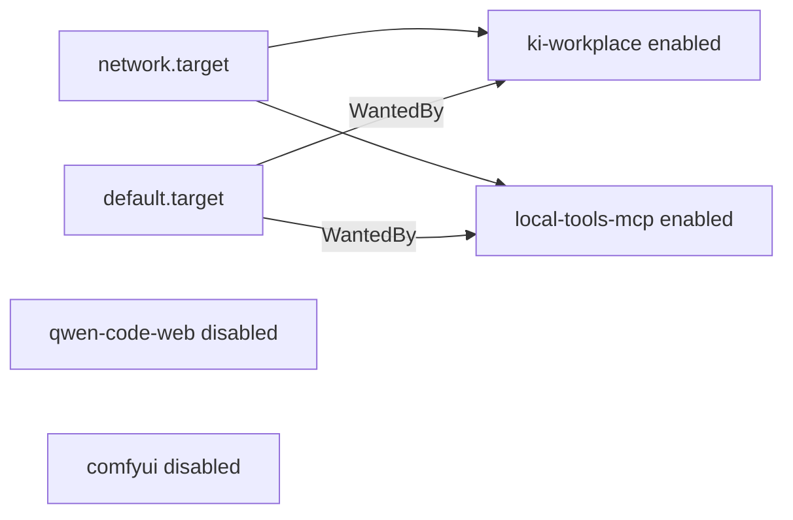

# Abnahme A01–A14

Stand: 21.09.2026 12:05. Source of Truth vorher: Handoff 21.09.2026 11:20. Diese Datei ist die **kanonische A01–A14-Definition**. Reboot-Nachweis 11:44 CEST ist PASS.

Suche im Repo, in `.agent/` und in `docs/`: **keine ältere kanonische A01–A14-Matrix**. Nur Erwähnungen als nächste Phase. Die untenstehende Matrix ist aus den bestehenden Projektanforderungen abgeleitet (Handoff, REQUIREMENTS, KI-Arbeitsplatz, Memory, PDF, Vision-QA, systemd-Units).

Gesamtstatus: **PASS WITH LIMITATIONS**

Nachtrag 21.09.2026 12:35: Runtime-Update Ollama **0.34.2** + Qwen Code **0.24.2** (Patches `--check` OK). Aliase/Security/Compact unverändert. QUALITY-E2E nach Update: Kette komplett mit Compact + doppeltem `pdf_render` — gleiche A14-Grenze. Belege `benchmarks/runtime-update-20260921/`. Handoff: `docs/CHATGPT_HANDOFF.md`.

Nachtrag 21.09.2026 14:28: Qwen-Image-2.1 isolierter Edit-Smoke **PASS**. A12-Pfad FLUX-T2I danach erneut PASS (Workplace `9fbab1ed7eaa` 42,31 s, MCP `7fb6b408ab1b`, Workflow-/Modell-Hashes unverändert). Kein `edit_image`. Belege `benchmarks/qwen-image-21-smoke-20260921/`. SoT: `docs/CHATGPT_HANDOFF.md`.

Nachtrag 21.09.2026 14:56: Frozen Edit-Workflow + `POST /api/images/edit` + MCP `edit_image` **PASS**. MCP 1.2.0/12 → **1.3.0/13**. A12-FLUX-Hashes unverändert (Job `bf5df1a30c27`). Keine Editing-UI. Belege `benchmarks/qwen-image-21-edit-20260921/`. SoT: `docs/CHATGPT_HANDOFF.md`.

Keine neuen Produktfunktionen. Kleinster systemd-Fix für den Boot-Zyklus. Sicherheitsoptionen unverändert: `trust: false`, `approvalMode: default`, kein YOLO, localhost only, keine Modell-Aliase geändert, kein 32K-Cutover.

---

## Gesamtmatrix

| ID | Prüfpunkte | Status | Beleg | Einschränkung |
|----|------------|--------|-------|---------------|
| A01 | Host, Speicher, Inventar | PASS | `benchmarks/acceptance-a01-a14-20260921/evidence.txt`, `preflight.txt` | Steam unter `~/.local/share` 315 G, nicht KI-Modelle |
| A02 | Localhost-Bindings | PASS | `ss -lntp` in evidence/preflight | 8188 nur im Bildermodus; nachgewiesen 127.0.0.1 |
| A03 | Ollama 0.34.0 + Override | PASS | Override SHA `7fb44d5f…`, `/api/version` | Runtime-Update 12:35: **0.34.2**, Override unverändert |
| A04 | Modelle/Aliase/Context | PASS | `ollama show` Modelfiles in preflight | 32K-QUALITY bench-only |
| A05 | KI-Arbeitsplatz / Modi | PASS | `probe-a05-a10.json` | Probe-Skript wertete Anzeigenamen fälschlich als FAIL; live nur lokale Modelle |
| A06 | Dienste / Lifecycle / systemd | PASS | Boot 11:44: MCP+Workplace aktiv, kein Zyklus; `reboot-mode-switch.json` | Qwen-Serve bleibt bis Cleanup neben ComfyUI |
| A07 | Qwen-Sicherheit | PASS | `~/.qwen/settings.json`, E2E-Restore | — |
| A08 | MCP / Tools / Permissions | PASS | `/health` 1.2.0, `/workspace/mcp` connected, E2E `proceed_once` | — |
| A09 | Persistentes Memory | PASS | `probe-a05-a10.json` A09_*, `.agent/history/` | DECISIONS durch Abnahme länger → QUALITY näher an Compact-Schwelle |
| A10 | Technischer PDF-Workflow | PASS | probe A10_create…ocr | — |
| A11 | PDF Vision-QA | PASS | unittest LiveVision 5/5, `tests.txt` | Mini-PDF kann `empty_page` / blank HIGH als False Positive |
| A12 | T2I + GPU-Cleanup | PASS | `a12-t2i.json`, Archiv `…/b8d57bc6dd22/` | Generate entlädt Ollama, stoppt Qwen Serve erst beim Cleanup |
| A13 | Backup / Rollback | PASS | Scripts + Backup-Dirs statisch | Produktiv nicht zurückgerollt |
| A14 | QUALITY-E2E + Doku | PASS WITH LIMITATIONS | Morgen 158 s PASS; Nachmittag 196 s Kette komplett mit Compact+doppeltem `pdf_read` | Compact sobald Prompt > 0.95×16384 |
| Tests | 75 unittest + live_mcp_smoke | PASS | `tests.txt` | Live-Vision probabilistisch, heute OK |

---

## Preflight (vor Dienständerungen)

Erfasst 21.09.2026 ~10:59 in `benchmarks/acceptance-a01-a14-20260921/preflight.txt`.

| Größe | Wert |
|-------|------|
| Git HEAD | `abd0282` `feat: raise FAST context to 32K…` |
| Ollama | 0.34.0 |
| Qwen Code | 0.23.4 |
| NVIDIA | 595.99.02, RTX 5080 16303 MiB |
| RAM / Swap | 31 Gi / 52 Gi |
| Frei `/` | 149 G |
| Frei `/mnt/ai-archive` | 314 G |
| Override SHA | `7fb44d5fbe5363ca9196bc92a95cb0d23766b4f853c491de19e134efa6d89bf4` |
| Compact | `compactionModel=local-fast`, `context.autoCompactThreshold=0.95` |
| `trust` | MCP `local-tools.trust=false` |
| `approvalMode` | `default` |
| Default-Modell | `local-fast` |
| Backup vor Units | `/mnt/ai-archive/backups/acceptance-a01-a14-20260921-105911` |
| systemd-Fix-Backup | `/mnt/ai-archive/backups/mcp-boot-cycle/20260921-105949` |

---

## systemd-Zyklus (Root Cause + Fix)

### Nachweis (dieser Boot)

```
Sep 21 09:45:12 Vollstrecker systemd[1910]: ki-workplace.service: Found ordering cycle:
  default.target/start after local-tools-mcp.service/start after ki-workplace.service/start - after default.target
Sep 21 09:45:12 Vollstrecker systemd[1910]: ki-workplace.service: Job local-tools-mcp.service/start deleted
  to break ordering cycle starting with ki-workplace.service/start
```

MCP startete erst 10:11 manuell. Qwen Serve blieb demand-only inaktiv, bis Agent-Modus.

Altes Graph (Backup-Units):

```text
ki-workplace: After=default.target, WantedBy=default.target
local-tools-mcp: After=ki-workplace, Wants=ki-workplace, WantedBy=default.target
→ Zyklus. systemd löscht MCP-Start, damit Workplace booten kann.
```

### Soll / Ist nach Fix



| Dienst | enable | Boot | Start |
|--------|--------|------|-------|
| Ollama | system enabled | automatisch | `:11434` |
| KI-Arbeitsplatz | enabled | automatisch | `:8790` / Proxy `:8791` |
| local-tools MCP | enabled, **unabhängig** | automatisch (Reboot 11:44 PASS) | `:8765` |
| Qwen Code Web | **disabled** | nein | Agent-Modus |
| ComfyUI | **disabled** | nein | Bildermodus |
| Open WebUI | Quadlet | automatisch | `:3000` pasta |

Angewendet: `scripts/apply-mcp-independent-boot.sh`

- Units: `After=network.target`, MCP ohne `Wants=ki-workplace`
- Härtung unverändert (`NoNewPrivileges`, `PrivateTmp`, MCP `ProtectHome=read-only`, `ProtectSystem=strict`, `RestrictAddressFamilies`)
- `systemd-analyze --user verify` Exit 0
- MCP Stop/Start 11:00:33: Workplace blieb aktiv, `/health` OK
- Rollback: `scripts/rollback-mcp-independent-boot.sh /mnt/ai-archive/backups/mcp-boot-cycle/20260921-105949`

Rechner-Neustart **21.09.2026 11:44** (Benutzer). Nachweis PASS.

### Manuelle Reboot-Checkliste (erledigt 21.09.2026 11:44)

1. Michal hat den Reboot ausgeführt.
2. Kein manueller MCP-/Qwen-Start vor der Messung (Journal: beide Units `Started` um 11:44:21).
3. Ist: `local-tools-mcp` = `active`, `ki-workplace` = `active`.
4. Ist: `qwen-code-web` und `comfyui` = `inactive` bis Mode-Switch.
5. `/health` = `version: 1.2.0`.
6. Journal dieses Boots: **kein** `ordering cycle`.
7. `POST /api/mode/agent` startet Qwen `:4170`. `POST /api/mode/images` startet ComfyUI `127.0.0.1:8188` (6,5 s). Cleanup stoppt beide; MCP bleibt aktiv. `live_mcp_smoke` und Memory/PDF-Smoke PASS.

---

## A01 – Host, Speicher und Inventar

**Anforderung:** Modelle auf `/srv/ai`, Archiv auf `/mnt/ai-archive`, kein versehentliches Volllaufen der Systemplatte durch KI-Artefakte.

**Methode:** `df`, `findmnt`, `du`, `ollama list`, Override `OLLAMA_MODELS`.

**Erwartet:** `/srv/ai` auf SSD, Archiv gemountet, Modelle nicht unter `/home` als Ollama-Store.

**Ist:** `/` und `/home` = `/dev/sda3` 921 G, 149 G frei. `/mnt/ai-archive` = `/dev/sdc1` 1,4 T, 314 G frei. Ollama-Store `/srv/ai/models/ollama` (Owner `ollama`, für User-`du` 0 Byte sichtbar). ComfyUI-Gewichte 12 G unter `/srv/ai/models/comfyui`. Bilder in `/mnt/ai-archive/images/inbox/`. 315 G Steam unter `~/.local/share/Steam` sind Gaming, nicht Modelle.

**Status:** PASS  
**Beleg:** `evidence.txt`  
**Einschränkung:** Ollama-Blobs sind für den User nicht listbar (`drwxr-x---`).  
**Folge:** keine.

---

## A02 – Localhost-Isolation

**Anforderung:** Produktive Dienste nur `127.0.0.1`. Ports 11434, 3000, 4170, 8188, 8765, 8790, 8791.

**Methode:** `ss -lntp`, Status-API `bindings`.

**Erwartet:** Kein `0.0.0.0` bei diesen Ports. Inaktive Bedarfsdienste erlaubt.

**Ist:** 11434, 3000, 4170, 8765, 8790, 8791 auf `127.0.0.1`. 8188 während A12 ebenfalls `127.0.0.1`, danach zu. ComfyUI/Qwen-Units: `--listen 127.0.0.1` / `--hostname 127.0.0.1`.

**Status:** PASS  
**Beleg:** preflight + `a12-t2i.json` `ports_during`  
**Einschränkung:** keine.  
**Folge:** keine.

---

## A03 – Ollama-Runtime

**Anforderung:** 0.34.0, Override unverändert, localhost, `MAX_LOADED_MODELS=1`, Flash Attention, KV `q8_0`, Parallel 1, Keep-Alive 5 m.

**Methode:** `/api/version`, Override-Datei, SHA256.

**Ist:** alles wie gefordert. SHA `7fb44d5fbe5363ca9196bc92a95cb0d23766b4f853c491de19e134efa6d89bf4`.

**Status:** PASS  
**Beleg:** preflight `=== override ===`  
**Einschränkung:** keine.  
**Folge:** keine.

---

## A04 – Modelle, Aliase, Context

**Anforderung:** `local-fast` = Qwen3.5 9B / 32768; `local-quality` = Qwen3.8 27B / 16384; Parents und Bench-Aliase bleiben; 32K nicht produktiv.

**Methode:** `ollama list`, `ollama show` Modelfile, Qwen `contextWindowSize`.

**Ist:**

| Alias | ID | Context | Parent |
|-------|----|---------|--------|
| `local-fast` | `cf8bd43c0e1c` | 32768 | `qwen3.5:9b` |
| `local-quality` | `ad1736a075f0` | 16384 | `qwen3.8:27b` (gleicher Blob wie `bench-qwen38-27b-16k`) |
| `bench-qwen38-27b-32k` | `d4bf257f520d` | bench | vorhanden, nicht Default |

Keine Modelle gelöscht oder neu gezogen.

**Status:** PASS  
**Beleg:** preflight `=== aliases ===`  
**Einschränkung:** 32K bleibt Benchmark-only.  
**Folge:** kein Cutover.

---

## A05 – KI-Arbeitsplatz

**Anforderung:** Status, Agent-/Bildermodus, nur lokale Modelle, keine frei wählbaren Cloud-Provider, kontrollierter Wechsel Qwen ↔ ComfyUI. Keine Browser-Automatisierung.

**Methode:** `GET /api/status`, `POST /api/mode/agent`, Proxy `/api/auth/providers` bzw. gefilterte Provider, T2I-Pfad.

**Ist:** Status OK. Agent-Modus startet Qwen. Cloud-Auth-Install und fremde Provider über Workplace blockiert (`A05_auth_providers_blocked`). Sichtbare Modelle: „Local Quality - Qwen3.8 27B“, „Local Fast - Qwen3.5 9B“ (IDs `local-quality` / `local-fast`). Filter `ALLOWED_QWEN_MODELS`. Bildermodus entlädt Ollama und startet ComfyUI.

**Status:** PASS  
**Beleg:** `probe-a05-a10.json`, `apps/ki-workplace/server.py`  
**Einschränkung:** Probe `A05_local_models_only` war `ok: false`, weil Anzeigenamen statt IDs geprüft wurden. Inhaltlich nur lokale Modelle.  
**Folge:** Probe nicht als FAIL werten.

---

## A06 – Dienste, Startreihenfolge, Lifecycle

**Anforderung:** Workplace automatisch, MCP zuverlässig, Qwen/ComfyUI bedarfsgesteuert, GPU nicht doppelt mit Modellen belegt, kein Zyklus.

**Methode:** Journal, `systemctl show`, Stop/Start, Mode-Switch, GPU-Cleanup.

**Ist:** Zyklus nachgewiesen und Units repariert. Live: MCP `Wants=` leer, Workplace `After=network.target`. Qwen disabled/active nur nach Agent. ComfyUI disabled/inactive bis T2I, danach wieder inactive. Cleanup VRAM 1795 MiB. MCP unabhängig restartbar.

**Status:** PASS  
**Beleg:** `benchmarks/runtime-update-20260921/preflight-post-reboot.txt`, `reboot-mode-switch.json`  
**Einschränkung:** Generate/`images` stoppt Qwen Serve erst im GPU-Cleanup.  
**Folge:** keine. Reboot-Checkliste erledigt.

---

## A07 – Qwen-Sicherheit

**Anforderung:** Default `local-fast`; QUALITY wählbar; `reasoning_effort=none`; Compact 0.95 / FAST; kein globales `max_tokens`; `trust: false`; `approvalMode: default`; kein YOLO; Shell und unnötige Builtins aus.

**Methode:** Settings lesen, E2E setzt QUALITY und restored Default, Config-Option `mode` bleibt `default`.

**Ist:** Settings wie gefordert. 27 disabled Tools inkl. `run_shell_command`, `web_fetch`, `skill`. YOLO existiert als Option, wurde **nicht** gewählt. Patches 0.23.4 `--check` OK (ToolSearch `dcdf42c5…`, Registry `ac82a673…`, Git-Snapshot omit).

**Status:** PASS  
**Beleg:** `~/.qwen/settings.json`, E2E restore-Log, patches `--check`  
**Einschränkung:** keine.  
**Folge:** keine.

---

## A08 – MCP, Registry, Permissions

**Anforderung:** Connected, genau die 12 Tools, inkl. `generate_image`, Memory, PDF, Vision-QA; ToolSearch-Kurznamen; Permission nur `proceed_once`; keine globale Freigabe.

**Methode:** `/health`, MCP `list_tools`, Serve `/workspace/mcp`, E2E-Votes.

**Ist:** `local-tools` 1.2.0, 12 Tools, `localhost_only=true`. Serve `mcpStatus: connected`. Votes ausschließlich `proceed_once` (6 am Morgen, 7 am Nachmittag). `always_allow` / YOLO false. `includeTools` listet dieselben 12 Namen. `alwaysLoadTools: true`.

**Status:** PASS  
**Beleg:** health JSON, `live_mcp_smoke`, E2E `votes`  
**Einschränkung:** keine.  
**Folge:** keine.

---

## A09 – Persistentes Agent-Memory

**Anforderung:** `memory_load` kompakt, Requirements vollständig, letzte Decisions vollständig, ältere als Überschriften, TASKS kompakt, `memory_update` append-only, History-Snapshot, keine erfundenen alten Decisions.

**Methode:** Live MCP load/update in probe.

**Ist:** Load OK. Requirements voll. Recent Decisions inkl. Hidden-Gen-Fix. Older headings. TASKS kompakt („Completed: 23 items…“). Update schrieb DECISIONS + History `20260921-110212-*` und später `20260921-110754-*`. Unittests Memory 8/8.

**Status:** PASS  
**Beleg:** probe A09_*, `.agent/DECISIONS.md`, `tests/test_agent_memory.py`  
**Einschränkung:** Mehr Decisions vergrößern `memory_load` und treiben QUALITY über 95 % Context.  
**Folge:** Compact-Verhalten unter A14.

---

## A10 – Technischer PDF-Workflow

**Anforderung:** create, read, inspect, render, edit, merge, split, OCR, technische QA gültig.

**Methode:** MCP-Tools gegen `.agent/tmp/a01-a14/`.

**Ist:** alle acht Operationen `ok: true`, QA ohne errors. OCR `ocrmypdf+tesseract` eng.

**Status:** PASS  
**Beleg:** `probe-a05-a10.json` A10_*  
**Einschränkung:** keine.  
**Folge:** keine.

---

## A11 – PDF Vision-QA

**Anforderung:** saubere Seite, problematische Seite, gültiges JSON-Schema, HIGH → `ok=false`, Korrekturpfad, False Positives dokumentiert.

**Methode:** `tests.test_pdf_vision_qa` Live + Mock; E2E `pdf_vision_qa`.

**Ist:** Live clean/clipped/blank 20,2 s OK; später discover inkl. overlap/table: 5 Live OK. Schema-Tests OK. HIGH auf clipped setzt Fail. Mini-PDF im Agent-E2E: `empty_page` / „mostly blank“ als False Positive, Inhalt korrekt.

**Status:** PASS  
**Beleg:** `tests.txt`, `docs/PDF_VISION_QA.md`  
**Einschränkung:** Mini-PDF False Positive bleibt bekannt.  
**Folge:** keine Produktänderung in dieser Phase.

---

## A12 – Lokale Bilderzeugung und GPU-Cleanup

**Anforderung:** bestehender Workflow, erlaubte Größe, Manifest inkl. Hashes, Archivpfad, GPU-Cleanup. Keine neuen Modelle.

**Methode:** `POST /api/images/generate` 512×512 Seed 42, danach `/api/gpu/cleanup`, `/api/mode/agent`.

**Ist:**

| Feld | Wert |
|------|------|
| ok | true |
| job | `b8d57bc6dd22` |
| runtime | 64,857 s |
| workflow | `flux2-klein-t2i-v1` |
| workflow SHA | `d9d752d5…` |
| UNET SHA | `97ed34fe…` |
| Archiv | `/mnt/ai-archive/images/inbox/2026-09-21/b8d57bc6dd22/` |
| Bind 8188 | `127.0.0.1` |
| Cleanup VRAM | 1795 MiB |
| ComfyUI danach | inactive |
| Agent danach | Qwen ready |

**Status:** PASS  
**Beleg:** `a12-t2i.json`, Manifest im Archiv  
**Einschränkung:** Während Generate blieb `:4170` (Qwen Serve) kurz parallel zu ComfyUI offen; GPU-Modelle waren entladen. Cleanup stoppte beide.  
**Folge:** optional später Serve mit Bildermodus stoppen; nicht in dieser Abnahme.

---

## A13 – Backup, Rollback, Fehlerverhalten

**Anforderung:** vorhandene Rollbacks prüfbar, produktiv nicht mutwillig zurücksetzen.

**Methode:** Scripts lesen, Inputs/Integritätschecks, Backup-Dirs listen.

| Thema | Rollback | Check | Backup |
|-------|----------|-------|--------|
| QUALITY 16K → 8K | `scripts/rollback-local-quality-16k.sh` | FROM `qwen3.8:27b`, `num_ctx 8192`, Parent muss existieren, FAST 32768 | `/mnt/ai-archive/backups/local-quality-16k-20260916-205745` |
| Hidden-Gen Settings | Settings aus Backup kopieren | `autoCompactThreshold` / `compactionModel` | `/mnt/ai-archive/backups/qwen-hidden-gen-20260916-224945` |
| Essay-Control | Settings/Memory-Backup | — | `/mnt/ai-archive/backups/qwen-essay-control-20260916-222500` |
| local-tools MCP | `scripts/rollback-local-tools-mcp.sh BACKUP` | Backup-Tree Pflicht | `/mnt/ai-archive/backups/local-tools-mcp` |
| MCP-Boot-Fix | `scripts/rollback-mcp-independent-boot.sh` | Units im Backup | `/mnt/ai-archive/backups/mcp-boot-cycle/20260921-105949` |
| Qwen-Patches | `scripts/rollback-qwen-toolsearch-mcp-alias-patch.sh` | Stock-SHAs versioniert | `/mnt/ai-archive/backups/qwen-code` |
| KI-Arbeitsplatz | `scripts/rollback-local-ui.sh` | Unit-State-Files | `/mnt/ai-archive/backups/ki-ui/` |
| Abnahme-Config | Kopie Units/Settings | — | `/mnt/ai-archive/backups/acceptance-a01-a14-20260921-105911` |

**Status:** PASS  
**Beleg:** Scripts + `ls` der Backup-Dirs  
**Einschränkung:** Kein destruktiver Produktiv-Rollback ausgeführt.  
**Folge:** keine.

---

## A14 – Vollständiger End-to-End-Agentlauf

**Anforderung:** eine Session, QUALITY, `memory_load` → PDF create → read → render → Vision-QA → `memory_update`, echte MCP-Calls, nur `proceed_once`, keine Duplikate, kein YOLO, keine lange 27B-Kompression nach `pdf_create`, Artefakte + Memory.

### Lauf 1 — 21.09. ~10:14 (vor systemd-Fix, Compact-Fix produktiv)

| Feld | Wert |
|------|------|
| Status | **PASS** |
| Dauer | **157,816 s** |
| Modell | `local-quality` ctx 16384, Offload 38 %/62 % |
| Tools | 6, je 1×, Reihenfolge korrekt |
| Votes | 6× `proceed_once` |
| Compact | `compressed=false` |
| YOLO / always | false |
| PDF/PNG | `.agent/tmp/quality-essay-e2e.pdf` / `.png` |
| VRAM Ende | 14490 MiB |
| Beleg | `benchmarks/acceptance-a01-a14-20260921/e2e-morning-158s.json` |

Keine 2-Minuten-27B-Pause nach `pdf_create`.

### Lauf 2 — 21.09. ~11:05 (nach systemd-Fix, größeres Memory)

| Feld | Wert |
|------|------|
| Harness | FAIL wegen Duplikat/`compressed` |
| Funktionale Kette | komplett, Dateien da, Memory geschrieben |
| Dauer | **195,595 s** |
| Tools | memory_load, pdf_create, pdf_read, **pdf_read**, pdf_render, pdf_vision_qa, memory_update |
| Votes | 7× `proceed_once` |
| Compact | ja, **15821 → ~9392** Tokens, FAST (`n_gen≈354`, VRAM ~9 GB), nicht 27B-Analysis nach `pdf_create` |
| PDF/PNG | `.agent/tmp/a01-a14/a14-e2e.pdf` / `.png` |
| Decision | `A01-A14 QUALITY E2E 2026-09-21` |
| Beleg | `e2e.json`, `e2e-a14-first-duplicate-pdf-read.json` |

Ursache: `memory_load` inkl. heutiger Decisions liegt über `0.95 × 16384 = 15565`. Compact auf FAST nach `pdf_read` → zweites `pdf_read`. Das ist **nicht** die alte versteckte 27B-Kompression nach `pdf_create`.

**Status:** PASS WITH LIMITATIONS  
**Einschränkung:** QUALITY-E2E ohne Compact nur, solange der Prompt unter ~15565 Tokens bleibt. Nach `pdf_render` kann FAST-Compact weiterhin erscheinen.  
**Folge:** optional Compact-Prompt-Patch (nicht implementiert). Reboot-Checkliste unabhängig.

---

## Automatisierte Tests

```text
Ran 75 tests in 83.313s
OK
live_mcp_smoke: ok, local-tools 1.2.0, 12 Tools, workflow flux2-klein-t2i-v1
patches --check: ToolSearch / Registry / Git-Snapshot OK
```

Beleg: `benchmarks/acceptance-a01-a14-20260921/tests.txt`

---

## Bekannte Einschränkungen (nicht still als PASS)

1. Reboot-Nachweis 11:44 ist PASS. Der alte Satz „nicht bewiesen“ gilt nicht mehr.
2. QUALITY-Compact ab ~95 % von 16384. Historisch: doppeltes `pdf_read` (12 Tools) bzw. 17216 Overflow (29 eager Tools). Seit 22.09.: Lazy Schemata + Compact State Ledger. Forced-Compact-E2E PASS, Folgeprompt **9318**, sechs Tools je 1×. Bericht: `docs/QWEN_COMPACT_STATE_LEDGER.md`.
3. Mini-PDF Vision-QA False Positive `empty_page` / blank HIGH.
4. T2I stoppt Qwen Serve erst im GPU-Cleanup.
5. Kein 32K-QUALITY-Cutover.
6. Image Editing, Browser-Agent und Desktop-Agent sind gebaut. Offen bleiben nur größere Bildgrößen (1536, 2K, 4K).

---

## Nächste Phase (nur Empfehlung, nicht bauen)

Supervisor / Multi-Agent. Knowledge Base v2 ist PASS (`docs/KNOWLEDGE_BASE_V2.md`). Continuity bleibt. Kein 32K-QUALITY. 1536 startet nicht. Aktueller Stand: `docs/CHATGPT_HANDOFF.md`.
